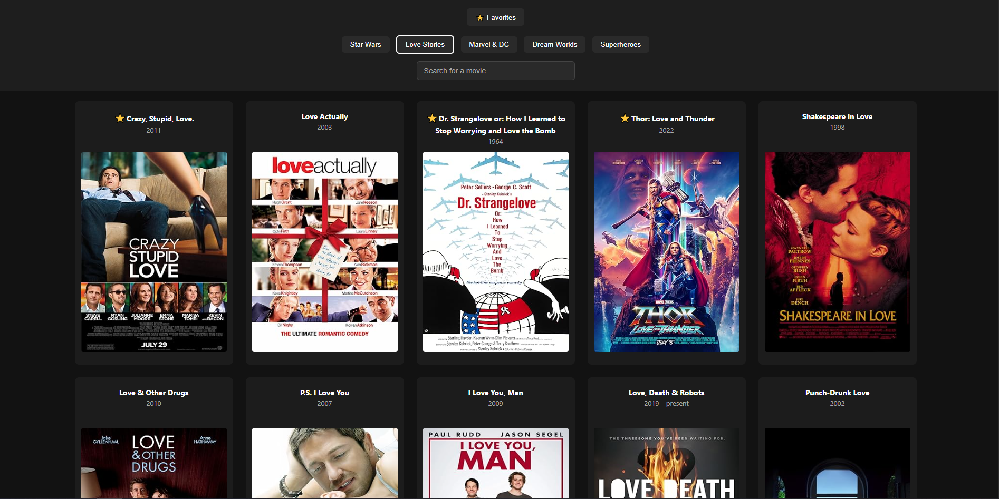

# 🎬 Movie Explorer

Movie Explorer is a responsive and interactive movie search app built with **HTML**, **CSS**, and **JavaScript**, using the **OMDb API**. It allows users to browse and discover movies by topic, search by title, and view detailed info via a modal popup.

 <!-- Add a real screenshot here from your app -->

---

## 🚀 Features

- 🔍 **Search by movie title**
- 🎯 **Filter by topic** using custom buttons
- 🪄 **Animated modal popup** with full movie details
- 📱 Responsive and mobile-friendly layout

---

## 🛠️ Technologies Used

- **HTML5** – structure
- **CSS3** – layout & animations
- **JavaScript (ES6+)** – logic and dynamic rendering
- **[OMDb API](https://www.omdbapi.com/)** – data source for movies

---

## 🔗 Live Demo
👉 [View the Live App](https://movie-app-swart-eta-92.vercel.app/)
